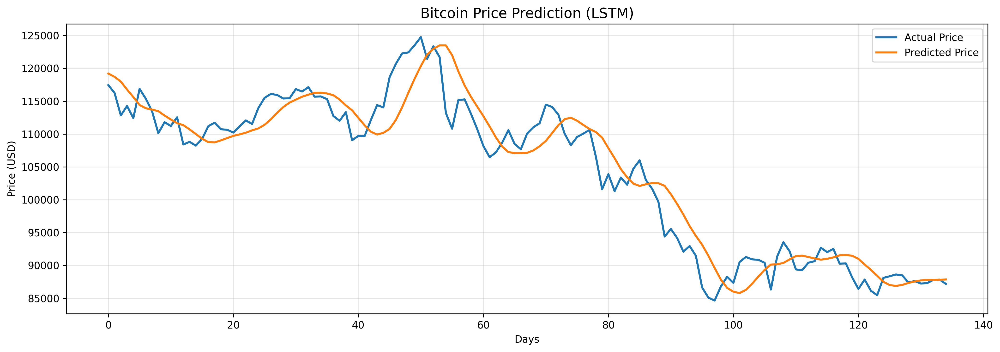
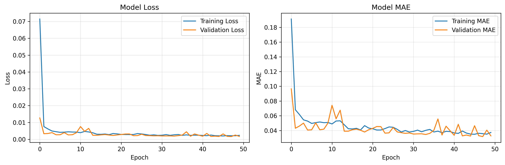

# 📈 Cryptocurrency Price Prediction using LSTM

Deep learning-based cryptocurrency price prediction using LSTM (Long Short-Term Memory) neural networks for time series forecasting.


## 🎯 Project Overview

This project implements LSTM neural networks to predict cryptocurrency prices using historical data and time series analysis. The model learns from past price patterns to forecast future trends for Bitcoin and Ethereum.

## ✨ Key Features

- **LSTM Architecture**: Specialized neural network for time series data
- **Multi-Cryptocurrency Support**: Bitcoin (BTC) and Ethereum (ETH) predictions
- **Real-time Data Fetching**: Yahoo Finance API integration
- **60-Day Lookback Window**: Uses 2 months of history for predictions
- **Comprehensive Evaluation**: RMSE, MAE, and MAPE metrics
- **Visualization**: Training curves and prediction comparisons

## 🛠️ Technology Stack

- **Python 3.9+**
- **TensorFlow 2.15** - Deep learning framework
- **Keras** - High-level neural networks API
- **yfinance** - Cryptocurrency data retrieval
- **Pandas & NumPy** - Data manipulation
- **Scikit-learn** - Data preprocessing and metrics
- **Matplotlib** - Visualization

## 🏗️ Model Architecture
```
Input Layer (60 time steps, 1 feature)
    ↓
LSTM Layer (128 units, return sequences)
    ↓
Dropout (0.2)
    ↓
LSTM Layer (64 units)
    ↓
Dropout (0.2)
    ↓
Dense Layer (32 units, ReLU)
    ↓
Output Layer (1 unit - Price prediction)
```

## 📊 Model Performance

**Bitcoin Price Prediction:**
- Time period: 2 years historical data
- Lookback window: 60 days
- Training/Test split: 80/20
- Early stopping with patience=10

**Evaluation Metrics:**
- RMSE (Root Mean Square Error)
- MAE (Mean Absolute Error)
- MAPE (Mean Absolute Percentage Error)

### Results Visualization


*LSTM price predictions vs actual prices*


*Model loss and MAE during training*

## 🚀 Installation
```bash
# Clone the repository
git clone https://github.com/code-craftsman369/crypto-price-prediction-lstm.git
cd crypto-price-prediction-lstm

# Install dependencies
pip install -r requirements.txt
```

## 💻 Usage

### Quick Start
```python
# Run the complete prediction pipeline
python model.py
```

### Fetch Data Only
```python
from data_fetcher import fetch_crypto_data, prepare_data

# Fetch Bitcoin data
btc_data = fetch_crypto_data('BTC-USD', period='2y')
btc_prepared = prepare_data(btc_data)
```

### Custom Prediction
```python
from model import CryptoPricePredictor

# Initialize predictor with custom lookback
predictor = CryptoPricePredictor(lookback=30)

# Prepare your data
X_train, X_test, y_train, y_test = predictor.prepare_training_data(df)

# Build and train model
predictor.build_model(input_shape=(X_train.shape[1], 1))
history = predictor.train(X_train, y_train, X_test, y_test)

# Make predictions
predictions = predictor.predict(X_test)
```

## 📦 Requirements
```
tensorflow==2.15.0
pandas==2.1.4
numpy==1.26.2
matplotlib==3.8.2
yfinance==0.2.32
scikit-learn==1.3.2
```

## 🎓 Learning Outcomes

This project demonstrates proficiency in:

- ✅ LSTM neural networks for time series
- ✅ Cryptocurrency data analysis
- ✅ Time series forecasting techniques
- ✅ Sequential data preprocessing
- ✅ Real-time data fetching with APIs
- ✅ Model evaluation and metrics
- ✅ Financial data visualization
- ✅ TensorFlow/Keras implementation

## 🔍 Key Techniques

1. **LSTM Networks**: Handles long-term dependencies in time series data
2. **Sequence Creation**: Sliding window approach for training data
3. **MinMax Scaling**: Normalizes prices to 0-1 range for LSTM
4. **Dropout Regularization**: Prevents overfitting (0.2 rate)
5. **Early Stopping**: Monitors validation loss for optimal training
6. **Real-time Data**: Yahoo Finance API for up-to-date prices

## 📝 Future Improvements

- [ ] Multi-feature inputs (volume, market cap, sentiment)
- [ ] Attention mechanisms for better predictions
- [ ] Multiple cryptocurrencies comparison
- [ ] Ensemble models (LSTM + GRU)
- [ ] Real-time prediction dashboard
- [ ] Trading strategy backtesting
- [ ] News sentiment integration
- [ ] Web interface for predictions

## 🔗 Related Projects

This project combines:
- **Deep Learning**: LSTM time series forecasting
- **Blockchain**: Cryptocurrency market analysis
- **Finance**: Price prediction and trend analysis

Check out my other projects:
- [Hotel Cancellation Predictor](https://github.com/code-craftsman369/hotel-cancellation-predictor)
- [SimpleDEX](https://github.com/code-craftsman369/SimpleDEX)

## 📜 License

This project is licensed under the MIT License - see the [LICENSE](LICENSE) file for details.

## 👤 Author

**Tatsu**

- GitHub: [@code-craftsman369](https://github.com/code-craftsman369)
- X: [@web3_builder369](https://twitter.com/web3_builder369)

## 🙏 Acknowledgments

- Yahoo Finance for cryptocurrency data API
- TensorFlow and Keras teams for excellent frameworks
- Deep Learning and crypto communities

## 📧 Contact

For questions or collaboration opportunities, please open an issue or reach out via GitHub.

---

⭐ If you find this project helpful, please consider giving it a star!

**Disclaimer**: This project is for educational purposes only. Cryptocurrency investments are highly volatile and risky. This model should not be used as the sole basis for investment decisions.